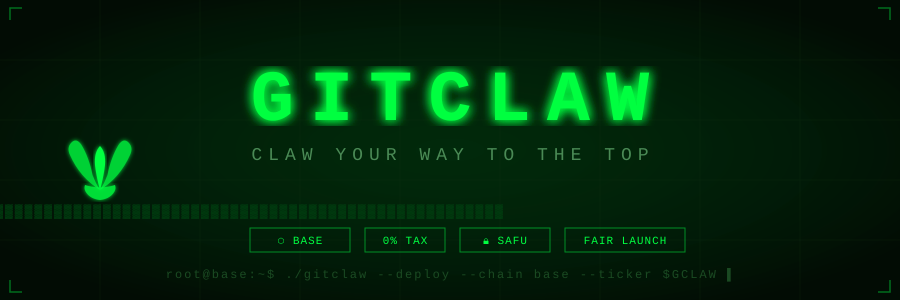

<div align="center">

<!-- BANNER -->


<br/>

<!-- BADGES -->
[](https://x.com/GitClawxyz)
[](https://t.me/GitClawxyz)
[](https://github.com/GitClawxyz/GitClaw)

[](https://base.org)
[](https://github.com/GitClawxyz/GitClaw)
[](https://github.com/GitClawxyz/GitClaw)
[](https://github.com/GitClawxyz/GitClaw)
[](https://github.com/GitClawxyz/GitClaw)

<br/>

```
██████╗ ██╗████████╗ ██████╗██╗      █████╗ ██╗    ██╗
██╔════╝ ██║╚══██╔══╝██╔════╝██║     ██╔══██╗██║    ██║
██║  ███╗██║   ██║   ██║     ██║     ███████║██║ █╗ ██║
██║   ██║██║   ██║   ██║     ██║     ██╔══██║██║███╗██║
╚██████╔╝██║   ██║   ╚██████╗███████╗██║  ██║╚███╔███╔╝
 ╚═════╝ ╚═╝   ╚═╝    ╚═════╝╚══════╝╚═╝  ╚═╝ ╚══╝╚══╝
                                                        
         $GCLAW • BASE CHAIN • CLAW YOUR WAY TO THE TOP
```

</div>

---

## `root@base:~$ cat README.md`

```
[ ✓ ] Token: $GCLAW
[ ✓ ] Network: Base Chain (Ethereum L2)
[ ✓ ] Supply: 1,000,000,000
[ ✓ ] Tax: 0% / 0%
[ ✓ ] LP: Locked 100%
[ ⚡ ] Status: BUILDING...
```

---

## 📖 About GitClaw

**GitClaw** (`$GCLAW`) is a community-driven meme token deployed on **Base Chain** — Coinbase's fast, low-fee Ethereum Layer 2 network. Built by the community, for the community.

We believe the next generation of crypto isn't built on empty promises — it's built on **transparency, community ownership, and zero bullshit tokenomics**. No hidden wallets. No rug mechanics. Just claws and conviction.

> *"Claw your way to the top, or get clawed trying."*

---

## ⬡ Why Base Chain?

| Feature | Base Chain |
|---|---|
| 🔗 **Network** | Ethereum Layer 2 by Coinbase |
| ⚡ **Speed** | ~2 second block time |
| 💸 **Fees** | Ultra-low gas fees |
| 🔒 **Security** | Secured by Ethereum |
| 🌊 **Ecosystem** | Growing DeFi + NFT ecosystem |
| 👥 **Users** | Millions of Coinbase users onboarding |

---

## 💎 Tokenomics

```
┌─────────────────────────────────────────────────────┐
│               $GCLAW TOKEN SPECIFICATIONS           │
├─────────────────────────────────────────────────────┤
│  Name         │  GitClaw                            │
│  Ticker       │  $GCLAW                             │
│  Network      │  Base (Ethereum L2)                 │
│  Total Supply │  1,000,000,000 (1 Billion)          │
│  Buy Tax      │  0%                                 │
│  Sell Tax     │  0%                                 │
│  LP Lock      │  100% Locked                        │
│  Ownership    │  Renounced after launch             │
│  Contract     │  TBA — Launching soon               │
└─────────────────────────────────────────────────────┘
```

### 📊 Supply Distribution

```
Liquidity Pool     ████████████████████████  60%  →  600,000,000 $GCLAW
Community/Marketing ████████                 20%  →  200,000,000 $GCLAW
Development Fund    ████                     10%  →  100,000,000 $GCLAW
Team (12mo vested)  ██                        5%  →   50,000,000 $GCLAW
Burn Reserve        ██                        5%  →   50,000,000 $GCLAW
```

---

## 🗺️ Roadmap

### `PHASE 01 — GENESIS` ⚡ **[LIVE NOW]**

```
[✓] Token contract creation
[✓] Website launch
[✓] Social media setup (X, Telegram, GitHub)
[▶] Whitepaper release
[▶] Community building (Telegram + X)
[ ] Fair launch on Base DEX (Uniswap v3)
[ ] Liquidity lock — 100%
[ ] Contract renouncement
[ ] CoinGecko listing application
[ ] CoinMarketCap listing application
```

---

### `PHASE 02 — GROWTH` ○ **[UPCOMING]**

```
[ ] 1,000+ holder milestone
[ ] KOL / influencer partnerships
[ ] Trending on DEXScreener & DEXTools
[ ] Base ecosystem integrations
[ ] Community AMA sessions (weekly)
[ ] Marketing campaign volume 1
[ ] Tier-2 CEX outreach
[ ] $GCLAW merch drop
[ ] GitClaw NFT collection teaser
[ ] 5,000+ community members
```

---

### `PHASE 03 — EXPANSION` ○ **[UPCOMING]**

```
[ ] 10,000+ holders milestone
[ ] GitClaw NFT collection full launch
[ ] $GCLAW staking platform v1
[ ] Tier-1 CEX listing
[ ] Cross-chain bridge deployment
[ ] GitClaw DApp v1.0 release
[ ] DAO governance launch
[ ] Major marketing campaign
[ ] Strategic partnership announcements
[ ] Base ecosystem grants application
```

---

### `PHASE 04 — DOMINANCE` ○ **[UPCOMING]**

```
[ ] 50,000+ holders
[ ] Top 500 CoinMarketCap ranking
[ ] GitClaw ecosystem v2.0
[ ] Multi-chain deployment (ETH, BSC, ARB)
[ ] Revenue sharing model for holders
[ ] GitClaw Labs launch
[ ] IRL events & community meetups
[ ] Strategic acquisitions
[ ] $100M market cap target
[ ] Full ecosystem maturity
```

---

## 🚀 How to Buy $GCLAW

```bash
# Step 1: Get a Wallet
→ Download MetaMask or Coinbase Wallet
→ Create wallet & secure your seed phrase

# Step 2: Add Base Network
→ Go to chainlist.org
→ Search "Base" → Add to MetaMask
→ Chain ID: 8453 | RPC: https://mainnet.base.org

# Step 3: Get ETH on Base
→ Bridge ETH at bridge.base.org
→ Or buy on Coinbase and withdraw to Base

# Step 4: Swap for $GCLAW
→ Go to app.uniswap.org (select Base network)
→ Paste $GCLAW contract address
→ Set slippage: 1–3%
→ Swap ETH → $GCLAW
→ 🎉 Welcome to the GitClaw army!
```

### Contract Address
```
TBA — Launching soon on Base Chain
```
> ⚠️ Always verify the contract address from our **official channels only** before buying.

---

## 🔒 Security & Trust

| Feature | Status |
|---|---|
| 🔒 **Liquidity Locked** | ✅ 100% Locked |
| 📝 **Contract Verified** | ✅ On BaseScan |
| 🚫 **Ownership Renounced** | ✅ After launch |
| 🔍 **Audit** | ✅ Community reviewed |
| 💰 **Dev Wallet** | ✅ Public & transparent |
| 🧾 **No Minting Function** | ✅ Fixed supply |

---

## 🌐 Community & Links

<div align="center">

| Platform | Link |
|:---:|:---:|
| 🐦 **X / Twitter** | [@GitClawxyz](https://x.com/GitClawxyz) |
| ✈️ **Telegram** | [t.me/GitClawxyz](https://t.me/GitClawxyz) |
| 🐙 **GitHub** | [GitClawxyz/GitClaw](https://github.com/GitClawxyz/GitClaw) |
| 🌐 **Website** | Coming soon |
| 📊 **DEXScreener** | TBA after launch |
| 🦄 **Uniswap** | TBA after launch |

</div>

---

## ⚠️ Disclaimer

```
$GCLAW is a community meme token on the Base blockchain.
This repository and its contents are NOT financial advice.
Cryptocurrency investments are highly volatile and risky.
Always Do Your Own Research (DYOR) before investing.
Never invest more than you can afford to lose.
```

---

<div align="center">

```
╔═══════════════════════════════════════════╗
║     GITCLAW — CLAW YOUR WAY TO THE TOP   ║
║         $GCLAW • BASE CHAIN • 2025       ║
╚═══════════════════════════════════════════╝
```

**⬡ Built on Base | 🔒 SAFU | 🔥 0% Tax | ⚡ Community First**

[](https://x.com/GitClawxyz)
[](https://t.me/GitClawxyz)

*© 2026 GitClaw Community. All rights reserved.*

</div>
